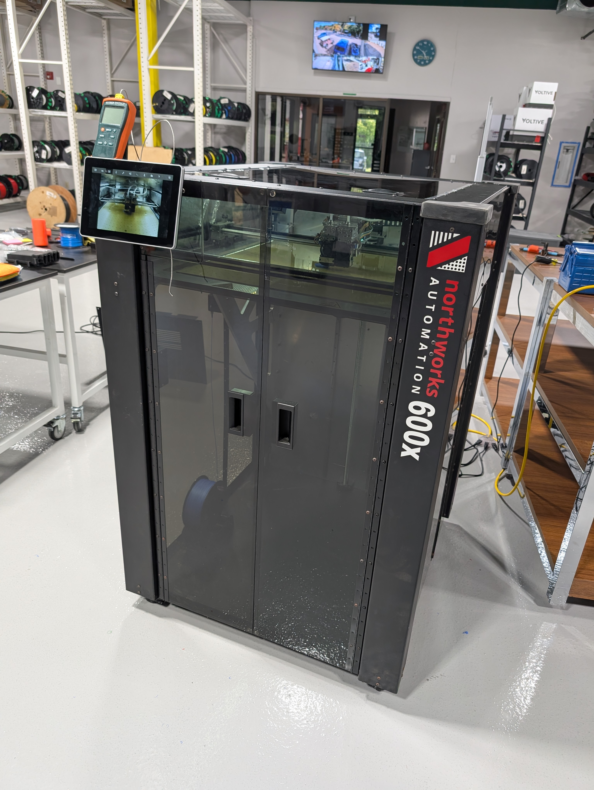
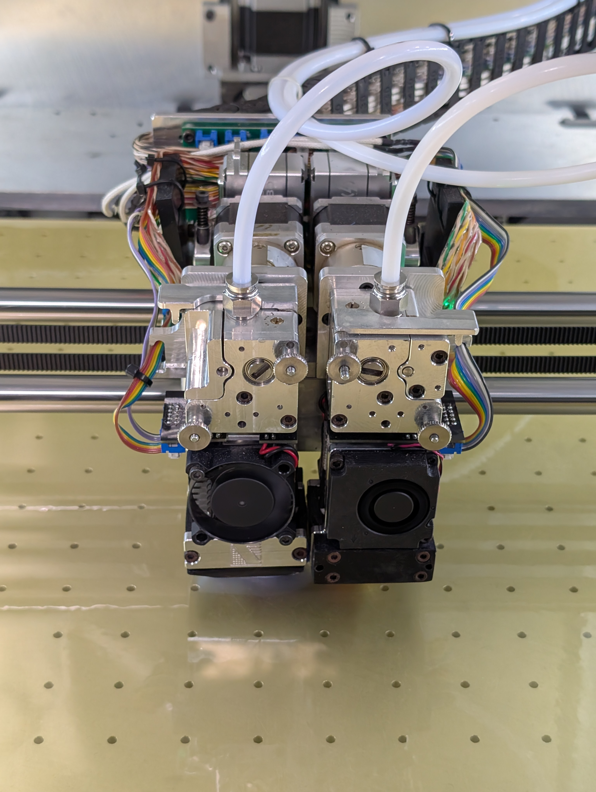
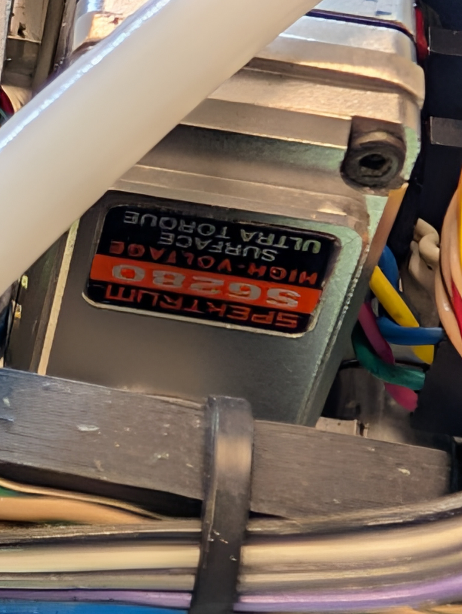
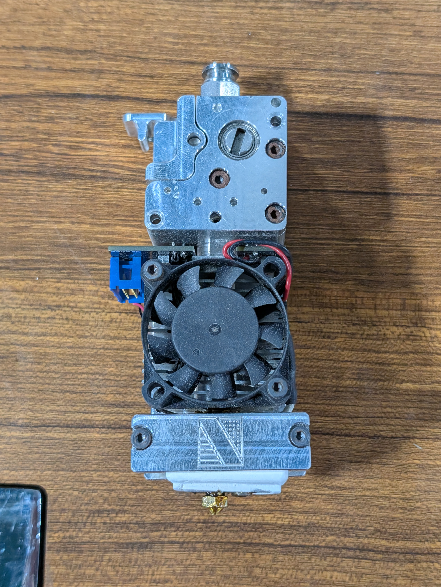

# Northworks 600x Klipper Migration and Information




We recently acquired a Northworks Automation 600x 3D printer. Northworks Automation appears to be a company out of Houston Texas that no longer exists. I did not do much research to confirm what happened or if they are operating under a different name now, but there is not much easily accessible information on them or their printers. 

To fully understand what we had and ensure we had full control over the printer, we worked through the design and configuration and ended up moving everything over to Klipper. Zero hardware changes were needed. We are printing reliably at over 3× the original acceleration (1000 → 3200 mm/s²) and ~1.5× the originaly travel speed (133 → 200 mm/s).

This is a very niche product but there may be more floating around out there. The printer is very well built, and we wanted to save anyone time in the future who may acquire one and want to do the same. This repo will be a repository for all of the knowledge and configuration we have learned on the printer, as well as any assets to assist in migrating to Klipper. 

This document will be structured as: 

1. Information on the printer design 
   
   1. Physical properties
   
   2. Software stack (original and now)
   
   3. Controller pin maps

## Repository layout

| Path                                                   | Contents                                                                                                                                                                             |
| ------------------------------------------------------ | ------------------------------------------------------------------------------------------------------------------------------------------------------------------------------------ |
| `klipper/`                                             | The Klipper configuration the printer runs today, as a deployable set.                                                                                                               |
| `klipper/config/`                                      | `printer.cfg` (template, set your `[mcu] serial`), the hardware and macro include files, `moonraker.conf`, `crowsnest.conf`, and an example `saved_variables.cfg`.                   |
| `klipper/boot/`                                        | The `config.txt` GPIO block the Raspberry Pi needs so the controller powers up at boot.                                                                                              |
| `klipper/PREFLIGHT.md` · `klipper/reference/pinmap.md` | What to measure before flashing anything; the Smoothieware → Klipper pin translation and the driver enable/chip-select analysis.                                                     |
| `orca-profiles/`                                       | OrcaSlicer machine (0.4 / 0.6 / 0.8 nozzle), process and filament profiles for the Klipper setup, plus an `install.sh` file for easy Linux deployment.                               |
| `original/`                                            | The original system exactly as recovered, for comparison against another unit. Nothing in it has been modified and it is provided as-found not bound by any license in this project. |
| `original/controller-sd/`                              | The controller's original microSD contents: Smoothieware `config`, `config-override` (what `M503` reports), `on_boot`, the stored bed mesh, and the vendor's 2020 backup config.     |
| `original/firmware/`                                   | `FIRMWARE.CUR`, the original Smoothieware fork, the only copy that exists plus the `strings` extraction it was reverse-engineered from.                                              |
| `original/pi/`                                         | The original `/usr/local/bin` control scripts and the OctoPrint plugin inventory. .                                                                                                  |
| `photos/`                                              | Reference photos of the machine.                                                                                                                                                     |

## Physical Properties

## General Design

- 600 x 600 x 900mm print area

- CoreXY

- High reduction lead screw z axis

- Dual servo lifted extruder heads

- Dual runout sensors at input end of extruder tubing

- Single piece aluminum heated bed with vacuum system

- Fully enclosed chamber with lighting and camera

- Standalone PID controlled chamber heater (controller inaccessible with rear cover on)

- Two 120V power connections

- Touchscreen mounted on front (**NEED MODEL**)

### Controller Design

- Panucatt Azteeg X5 GT (LPC1769) controller

- Five Panucatt Bigfoot BSD2660  
  (TMC2660) drivers on a custom daughterboard

- Raspberry Pi 4B 4G w/ GPIO controlled relay board

## Software Stack

| Layer                | Original                                                                                                                                                                                                                                                                                                                                                                                                   | Replaced by (Klipper migration)                                                                                |
| -------------------- | ---------------------------------------------------------------------------------------------------------------------------------------------------------------------------------------------------------------------------------------------------------------------------------------------------------------------------------------------------------------------------------------------------------- | -------------------------------------------------------------------------------------------------------------- |
| Controller firmware  | **Smoothieware, vendor fork `edge-46d1756`** (built 2021-07-16, flashed 2021-09-09) on the LPC1769 @ 120 MHz. Not stock: adds a dual-head tool manager, two-probe Z system and ~a dozen custom codes (`M672/M673/M675/M506/M510/M511/M518/M676`, `M109.1`, `G30.1/G30.3/G32/G33`, `M374.1/M375.1`). Config lives on the controller's own 4 GB microSD (`config`, `config-override` via `M500`, `on_boot`). | **Klipper v0.13** (host on the Pi, MCU firmware on the LPC1769)                                                |
| Bootloader           | Smoothieware 16 KiB bootloader (flashes any `firmware.bin` found on the SD at boot)                                                                                                                                                                                                                                                                                                                        | **Retained**: Klipper is linked at 0x4000 and flashed the same way                                             |
| Host OS              | **OctoPi 0.18.0**: Raspbian 10 (buster), Python 3.7, hostname `octopi`                                                                                                                                                                                                                                                                                                                                     | Raspberry Pi OS Lite, Debian 13 (trixie), Python 3.13                                                          |
| Print server         | **OctoPrint 1.8.4** (venv at `/home/pi/oprint`, user `pi` with passwordless sudo)                                                                                                                                                                                                                                                                                                                          | **Moonraker v0.10** + Klipper's virtual SD card                                                                |
| Reverse proxy        | **haproxy** on :80/:443 (self-signed cert); nginx also installed but inert (proxied to a port nothing listened on)                                                                                                                                                                                                                                                                                         | nginx (installed by KIAUH for Fluidd)                                                                          |
| Web UI               | OctoPrint web UI, widened by the Themeify 1.2.2 plugin                                                                                                                                                                                                                                                                                                                                                     | **Fluidd v1.37**                                                                                               |
| Touchscreen HMI      | SysV `touchui` service → xinit → **Chromium `--kiosk`** loading the same OctoPrint, skinned by the **TouchUI 0.3.18** plugin (abandoned upstream since 2018); Chromium remote debugger left open on :9222                                                                                                                                                                                                  | **HelixScreen v0.99**                                                                                          |
| Machine control UI   | **OctoPrint-NWTools** vendor plugin: reported "0.2.8" but really `devel` @ `cc105b6` (2022-05-06). Two tabs (Tools, Calibrate) driving every machine function: head lift/lock, probing, tip-delta, cabinet, lights, power                                                                                                                                                                                  | Klipper macros (LEFT/RIGHT operator set, PRINT_START/END, calibration macros) listed in Fluidd and HelixScreen |
| GPIO control         | wiringPi `gpio` binary via vendor shell scripts in `/usr/local/bin` (`machine`, `jreset`, `lights`, `cabinet`, etc) called from the plugin with `shell=True`                                                                                                                                                                                                                                               | Klipper **Linux MCU** `[output_pin]`s; boot defaults in `config.txt`                                           |
| Filament sensors     | **Filament Sensors Revolutions XL 1.0.0** on BCM 22/23                                                                                                                                                                                                                                                                                                                                                     | Klipper `[filament_switch_sensor]`                                                                             |
| Bed levelling        | Firmware 8×8 probe grid + **`hgrid` / GridNorm** (vendor ARM binary, Armadillo least-squares outlier smoothing; hard-coded 7×7 buffers vs the 8×8 grid) + **Bed Visualizer 1.1.1** polling `M375.1`                                                                                                                                                                                                        | Klipper `[bed_mesh]` 12×12 bicubic, Fluidd heightmap                                                           |
| Camera               | mjpg-streamer via `webcamd`, 960×540 @ 10 fps (w/ experimental FFmpeg HLS service)                                                                                                                                                                                                                                                                                                                         | **crowsnest v5** (ustreamer) + moonraker-timelapse                                                             |
| Firmware update path | `updatefirm` / `mountctl` scripts: mount the controller's SD over USB mass storage, copy `firmware.bin`; **Upload Anything 1.0.1** let the `.bin` through OctoPrint's uploader                                                                                                                                                                                                                             | SD card pull                                                                                                   |
| Networking           | Vendor-modified `netconnectd` plugin + `setwifi` / `changewifi` / `sethostname` scripts rewriting `octopi-wpa-supplicant.txt`                                                                                                                                                                                                                                                                              | Stock Raspberry Pi OS networking                                                                               |
| Boot sequence        | `config.txt` presets GPIO 4/17/24/27 (controller on, lights on, **cabinet heater on**); `juicystart.service` pulses the controller reset then waits 10 s before OctoPrint; `splashscreen.service`                                                                                                                                                                                                          | `config.txt` `[all]` block (cabinet heater **off** at boot); Klipper connects directly                         |
| Other plugins        | 27 registered, incl. PrintTimeGenius 2.2.8, Active Filters Extended 0.1.0                                                                                                                                                                                                                                                                                                                                  | —                                                                                                              |
| Slicer               | **Simplify3D** (the recovered "Tommys Settings" profile, emitting the vendor's custom codes in start/tool-change G-code)                                                                                                                                                                                                                                                                                   | **OrcaSlicer** with Klipper-native machine/process/filament profiles                                           |

## Controller Pin Map

| Function       | Step   | Dir      | CS (TMC2660) | Notes                       |
| -------------- | ------ | -------- | ------------ | --------------------------- |
| X (α)          | `P2.2` | `P0.20`  | `P0.19`      | drives the board's "Z" slot |
| Y (β)          | `P2.1` | `P0.11`  | `P0.10`      |                             |
| Z (γ)          | `P2.3` | `P0.22`  | `P0.21`      | drives the board's "E" slot |
| E0 (T0, LEFT)  | `P2.8` | `!P2.13` | `P4.29`      |                             |
| E1 (T1, RIGHT) | `P2.0` | `P0.5`   | `P0.4`       | drives the board's "X" slot |

| Input / output            | Pin                      | Notes                                                                            |
| ------------------------- | ------------------------ | -------------------------------------------------------------------------------- |
| X endstop (min, −38)      | `^P1.25`                 |                                                                                  |
| Y endstop (max, 600)      | `^P1.24`                 |                                                                                  |
| Z physical switch         | `^P1.26`                 | triggers 6.5 mm below nozzle plane; **not** the Z endstop. Z homes on the probe. |
| T0 contact probe          | `^P1.19`                 | Klipper `[probe]`; coaxial with the nozzle                                       |
| T1 contact probe          | `^P1.20`                 | `[gcode_button]` (Klipper allows one `[probe]`)                                  |
| Probe sensor power        | `P1.18`                  | ON from boot, never cycled                                                       |
| Probe calibrate/mode line | `P1.21`                  | driven LOW = run mode; floating = LEDs flash, inert                              |
| Bed heater / sensor       | `P2.7` / `P0.23`         | Honeywell 100K 135-104LAG-J01                                                    |
| T0 heater / sensor        | `P2.4` / `P0.24`         | **PT1000**, pullup 4700                                                          |
| T1 heater / sensor        | `P2.5` / `P0.25`         | **PT1000**, pullup 4700                                                          |
| Front heatsink fans       | `P0.26`                  | both heads, one channel (vendor "misc")                                          |
| Backside heatsink fans    | `P1.22`                  | both heads, one channel (vendor "fan", M106)                                     |
| T0 lift servo             | `P3.25`                  | Spektrum S6280, hwpwm                                                            |
| T1 lift servo             | `P1.23`                  | Spektrum S6280, hwpwm                                                            |
| Spare (chamber, unwired)  | `P2.11` out, `P1.31` ADC | prepared block commented out                                                     |

### Raspberry Pi GPIO (BCM)

| GPIO | Role                                 | Owner                                        | Polarity                                |
| ---- | ------------------------------------ | -------------------------------------------- | --------------------------------------- |
| 4    | Machine / controller power           | **host OS** (`config.txt`), not Klipper      | active-low, ON at boot                  |
| 17   | Cabinet lights                       | Klipper `[output_pin lights]`                | active-low, ON at boot                  |
| 27   | Cabinet heater enable (external PID) | Klipper `[output_pin cabinet]`               | active-low, OFF at boot (vendor had ON) |
| 24   | Controller reset line                | **host OS**                                  | idle low                                |
| 22   | T1 (RIGHT) filament runout           | Klipper `[filament_switch_sensor t1_runout]` | pull-up                                 |
| 23   | T0 (LEFT) filament runout            | Klipper `[filament_switch_sensor t0_runout]` | pull-up                                 |
| 3    | Physical shutdown button             | `dtoverlay=gpio-shutdown`                    |                                         |

## Derived Constants

| Constant                  | Value                                                                                     | How it was established                                                                                                       |
| ------------------------- | ----------------------------------------------------------------------------------------- | ---------------------------------------------------------------------------------------------------------------------------- |
| `rotation_distance` X/Y   | 34.0 @ 16 µsteps                                                                          | 94.11765 st/mm = exactly a 17-tooth GT2; dimensionally accurate prints                                                       |
| `rotation_distance` Z     | 0.5743 @ 8 µsteps                                                                         | 2785.88 st/mm; part-height accuracy                                                                                          |
| `rotation_distance` E0/E1 | 6.8522 @ 32 µsteps                                                                        | 934 st/mm, identical on both (vendor `M92 E934` both channels); free-air 100 mm test accurate on both                        |
| `sense_resistor` all      | 0.100                                                                                     | shunts read R100                                                                                                             |
| `run_current` X/Y         | 0.88 A RMS                                                                                | replicates the historical current: original "2500 mA" × Smoothieware's 50 mΩ default against the real 100 mΩ shunt, peak→RMS |
| `run_current` Z           | 0.55 A RMS                                                                                | same derivation from "1500 mA"                                                                                               |
| `run_current` E0/E1       | 0.58 A RMS                                                                                | "800 mA" peak on the correct shunt                                                                                           |
| Direction rule            | Klipper `dir_pin` polarity = the OPPOSITE of every Smoothieware `!` marking on this board | X/Y/Z confirmed at the machine; E0/E1 by rule, verified by filament load                                                     |
| Hotend sensors            | PT1000                                                                                    | both read 172.8 °C at 23 °C ambient through the vendor's "beta 4066" curve ⇒ 1088 Ω = PT1000                                 |
| Servo pulse conversion    | width = Smoothieware duty% × 20 ms                                                        | original `M673 A7.15` → 1.430 ms; the released midpoint 6.2 % ↔ 1.240 ms matched live                                        |
| T1 X offset               | −52.25 mm                                                                                 | original `M675.1 X-52.25` (override wins over config's −47.58)                                                               |

Servo widths (seconds in `_TH`): T0 up **0.001430** / locked **0.001050** / probe-up 0.001480 /  
probe-down 0.001080 · T1 up **0.001450** / locked **0.001815** / probe-up 0.001440 / probe-down  
0.001920. **T1's sense is reversed**: longer pulse = more engaged

## Printhead and Nozzle Design

The printheads are the most unusual part of this machine and the reason the Klipper
migration was non-trivial. Two independent heads share one CoreXY carrier. Each is
raised and lowered by its own servo, and each carries a nozzle-contact sensor. There
is no separate probe, the nozzle itself is the probe tip.



### The lift mechanism

|              |                                                                                       |
| ------------ | ------------------------------------------------------------------------------------- |
| Servo        | **Spektrum S6280** per head digital surface servo, 6.0–8.4 V, 26–36 kg·cm, metal gear |
| Drive signal | 50 Hz PWM (20 ms frame); position set by pulse width                                  |
| Control pins | T0 `P3.25`, T1 `P1.23` (hardware PWM on the controller)                               |
| Lift travel  | **NEED MEASUREMENT** (mm of nozzle rise between locked and lifted)                    |
| Linkage      | **NEED DESCRIPTION** (arm/cam geometry)                                               |



Each head has three postures. Only the middle one is stable without power:

| Posture                 | Purpose                                            | T0 pulse | T1 pulse | Holds unpowered?                                   |
| ----------------------- | -------------------------------------------------- | -------- | -------- | -------------------------------------------------- |
| **Lifted**              | idle head clear of the part                        | 1.430 ms | 1.450 ms | No, falls within seconds                           |
| **Released** (midpoint) | service position; free to move by hand             | 1.240 ms | 1.633 ms | **Yes**                                            |
| **Locked**              | printing position                                  | 1.050 ms | 1.815 ms | Marginal, status LED flickers under printing loads |
| Probe deploy            | slightly gentler than locked, used for bed probing | 1.080 ms | 1.920 ms | —                                                  |

Notes we learned

- **Both working postures must be held energised during a print** (the original firmware did the same for the lifted head)

- Every posture change should travel through the midpoint rather than jumping, which is what the original firmware's three-phase `M672` move did and what the Klipper macros reproduce with a stepped glide.

- The probe-deploy must be distinct from the locked posture: probing in the harder-engaged locked posture is 3–7× less repeatable

### The nozzle-contact sensor

Each head carries a small sensor board (**NEED IDENTIFICATION**) that
detects the head being displaced when the nozzle meets the bed. It is not a simple switch:

| Line             | Pin      | Behaviour                                                                    |
| ---------------- | -------- | ---------------------------------------------------------------------------- |
| Power            | `P1.18`  | Both boards. Powered from boot and never cycled.                             |
| Calibrate / mode | `P1.21`  | Driven low = run mode. Left floating, the LEDs flash and the output is inert |
| Output T0        | `P1.19`  | Open at rest, triggered on contact                                           |
| Output T1        | `P1.20`  | Same                                                                         |
| Status LEDs      | on-board | Lit steady in run mode; indicate head state                                  |

Behaviour established by testing which every probing routine has to respect:

- The board sets its reference on the first head-lift transition after power-up and is inert until it sees one. Every probe must start with a deliberate lift before the descent.
- It re-references continuously during stillness and slow movement. A slow servo glide into the probe posture lets it re-zero mid-travel, after which the seated head reads as triggered and homing accepts a phantom touch. Pre-measurement moves must be crisp. Longer settle delays make this worse.
- It is sensitive to vibration through the carriage: an energised servo on the other
  head dithers enough to cause phantom triggers. The idle head must sit at its unpowered midpoint during any probing.
- The trigger is not first contact. The head must be pushed roughly **0.5 mm** past the
  point where the nozzle touches before the sensor fires so a proper z-calibration is still needed.
- Repeatability in the probe posture is excellent: **0.003–0.006 mm range**, standard
  deviation ~0.001–0.002 mm, over 10 samples at 0.5 mm/s.

### Hotend and extruder



|                    |                                                                                                              |
| ------------------ | ------------------------------------------------------------------------------------------------------------ |
| Hotend             | **NEED DESIGN DESCRIPTION** (original firmware allowed 500 °C, not sure if that was on purpose)              |
| Temperature sensor | **PT1000**, both heads (the original config claimed a 100K NTC — the fork converted it in code)              |
| Heaters            | T0 `P2.4`, T1 `P2.5`                                                                                         |
| Nozzle             | 0.4 mm on both heads as received, have tested 0.8                                                            |
| Extruder           | Geared, **934 steps/mm** at 32 µsteps (6.8522 mm/rev) — **NEED MODEL / RATIO**                               |
| Filament path      | 1.75 mm, PTFE guide tube from the spool to each extruder; runout sensor at the tube's inlet                  |
| Cooling            | Two heatsink fans per head — front pair on `P0.26`, rear pair on `P1.22`, each channel shared by both heads. |

### Geometry and offsets

- T1 sits **52.25 mm in −X** from T0 (Y offset 0). The probe is coaxial with each nozzle.
- The original firmware probed T0 at (290, 310) and T1 at (291, 311); Klipper homes Z at (290, 310).
- **T1's nozzle tip sits ~0.34 mm higher than T0's when both are locked.** This is the
  tool Z offset. 
- The probe posture and the locked posture differ by **~0.10 mm** on T0

### How the original firmware used the mechanism

`M672` lifted/locked a head through the midpoint in three phases; `M673 A/B/C/D` stored the four servo positions; `M281` released a servo after a move. `G30.1 Q` took a nozzle touch at every print start to set Z zero; `G30.3 D T1` measured the T1 tip delta with T1's own sensor at every print start; `M670 O`/`Q` stored the per-tool home offsets; `M510`/`M511` handled sensor calibration; `M565` held the (zero) probe offsets. The physical Z switch was not the Z reference (it trips 6.5 mm below the nozzle plane).

### How Klipper uses it

Both servos are `[servo]` sections driven by exact pulse widths (the vendor's duty-cycle values × 20 ms). T0's sensor is the Klipper `[probe]` and the Z endstop (`probe:z_virtual_endstop`); the probe's activate/deactivate G-code performs the lift →
deploy snap sequence and the glide back. T1's sensor is a `[gcode_button]`, since Klipper allows one probe, and drives a stepped-descent macro for the tool delta. The head-posture choreography lives in the `T0`/`T1` tool-change macros.

## Issues found on our printer

Everything below was discovered while reverse-engineering and migrating the machine.

- **Stepper motor currents were ~⅓ of intended.** The motion drivers were
  left on Smoothieware's default 50 mΩ sense-resistor value, but the boards carry 100 mΩ shunts, and Smoothieware's current figure is peak where the datasheet value is RMS. The "2500 mA" X/Y setting actually ran ~0.88 A RMS.

- **Filament runout sensors could never have worked.** The two channels were assigned to the wrong tools (the "T0 runout" input physically watched T1's filament and vice-versa), and, one channel's polarity was inverted.

- **The cabinet heater was energised at every Raspberry Pi boot**. The GPIO default in `config.txt` drove the heater relay on before any software ran.

- **The T1 hotend's PID gains were the bed's** (`M301 S1` held the bed heater's values), so the second head would oscillate the first time it was used.

- **The hotend sensors are PT1000s, but the config declared a 100K NTC** ("beta 4066").

- **The X and Y driver chip-select pins were swapped in the config** relative to the
  physical slots. This was invisible because the X and Y motors are identical.

- **All automatic safety interlocks were disabled**: `watchdog_timeout 0`, both thermal runaway timeouts `0`, `halt_on_alarm false` on every driver. The ±50 °C runaway window was the only thermal guard.

- **The boot script's TMC register writes (`M911.2`) addressed the wrong drivers** and were silent no-ops. Had they registered, they would have broken CoreXY squareness (double-edge stepping on one belt motor only) and over-driven an extruder.

- **The bed-mesh outlier filter (`hgrid` / GridNorm) had a stack buffer overflow**: its buffers are hard-coded for a 7×7 grid while the firmware probes 8×8.

- **A "CAM" feature (`M676`/`M518`) appears to do nothing on this machine**. Firmware strings and UI buttons exist for it, but no physical change can be seen.

- **T0 filament runout sensor** cable/connector fault: the sensor's LED tracked the filament but its output never reached the Pi

## Klipper Migration

### Pi Setup

1. Flash Raspberry Pi OS Lite (64-bit) to a new card
2. Append the GPIO defaults to `/boot/firmware/config.txt` at the end, under an `[all]` header:

```
[all]
# Northworks 600x relay defaults (all active-low)
gpio=4=op,dl                              # machine/controller power: ON at boot
gpio=17=op,dl                             # cabinet lights: ON at boot
gpio=27=op,dh                             # cabinet heater: OFF at boot (vendor had ON)
gpio=24=op,dl                             # controller reset line: idle
dtoverlay=gpio-shutdown,gpio_pin=3,debounce=200
```

Verify after boot with `pinctrl get 4 17 24 27`.  
3. KIAUH: install Klipper, Moonraker, Fluidd, crowsnest, moonraker-timelapse.  
4. **Linux MCU** for host GPIO (`hardware-host.cfg` needs it):

```
cd ~/klipper && make menuconfig      # Micro-controller Architecture: Linux process
make && sudo make flash
sudo cp scripts/klipper-mcu.service /etc/systemd/system/ && sudo systemctl enable --now klipper-mcu
```

5. HelixScreen: follow the repo installer (it registers itself with Moonraker's update manager).
6. Copy `config/*.cfg` and `config/moonraker.conf` into `~/printer_data/config/`; set the `[mcu] serial` after the firmware flash (§3). `saved_variables.cfg` is created by Klipper on first `SAVE_VARIABLE`.
7. Camera: crowsnest serves `/webcam/?action=stream`; Moonraker's webcam entry "Internal" (`mjpegstreamer-adaptive`).

### Controller firmware

```
cd ~/klipper && make menuconfig
#   Micro-controller Architecture: LPC176x
#   Processor model: lpc1769
#   Bootloader offset: 16KiB bootloader   <- CONFIRMED from FIRMWARE.CUR's vector table (no handler below 0x4000)
make
```

**First flash** uses the Smoothieware bootloader's own mechanism. The controller exposes its microSD over USB mass storage and flashes any `firmware.bin` at boot:

```
lsblk                                            # Smoothieware's mass storage = /dev/sda1
sudo mkdir -p /mnt/ctl && sudo mount /dev/sda1 /mnt/ctl
sudo cp ~/klipper/out/klipper.bin /mnt/ctl/firmware.bin && sudo umount /mnt/ctl
pinctrl set 24 op dh && sleep 0.5 && pinctrl set 24 op dl    # pulse the reset line
```

**Every later flash** (Klipper updates, or reverting): the USB-mass-storage route disappears once  Klipper runs. Pull the microSD, write `firmware.bin` from another machine, reinsert, power-cycle.  The bootloader survives and keeps flashing.

**Serial** enumerates as `/dev/serial/by-id/usb-Klipper_lpc1769_<id>-if00` 

### Configuration files

Everything below is what was set specifically for this printer. Values not listed are Klipper defaults.

#### `printer.cfg`

- Include order: `hardware-steppers`, `hardware-extruders`, `hardware-heaters`, `macros-client`, `macros-toolhead`, `hardware-probe`, `hardware-host`, `macros-print`, `macros-operator`, `timelapse.cfg`, `macros-tuning`. `macros-toolhead` must precede `hardware-probe`: the lift servo is the probe deploy.
- `[printer]`: `kinematics: corexy`, `max_velocity: 200`, `max_accel: 3200`, `max_z_velocity: 3.3`, `max_z_accel: 50`, `square_corner_velocity: 5`.
- `[idle_timeout] timeout: 1800`.
- `[force_move] enable_force_move: True`. Needed to re-declare Z with `SET_KINEMATIC_POSITION` after a motors-off with a part on the bed.
- `[virtual_sdcard]`, `[pause_resume]`, `[exclude_object]`, `[respond]`, `[display_status]`.
- The SAVE_CONFIG autosave block holds `[probe] z_offset`, the three PID sets and `[bed_mesh default]`. Klipper does not allow autosaved options in included files, so `z_offset`, `control` and `pid_*` are commented out in the includes.

#### `hardware-steppers.cfg`

- X: `step_pin P2.2`, `dir_pin P0.20`, `endstop_pin ^P1.25`, `position_endstop -38`, `position_min -38`, `position_max 600`, homes to min.
- Y: `step_pin P2.1`, `dir_pin P0.11`, `endstop_pin ^P1.24`, `position_endstop 600`, `position_max 600`, homes to max.
- X and Y: `rotation_distance 34.0`, `microsteps 16`, `homing_speed 50`, `second_homing_speed 25`, `homing_retract_dist 5`.
- Z: `step_pin P2.3`, `dir_pin P0.22`, `rotation_distance 0.5743`, `microsteps 8`, `endstop_pin probe:z_virtual_endstop`, `position_min -4`, `position_max 900`, `homing_speed 3`, `second_homing_speed 1`, `homing_retract_dist 2`.
- No `dir_pin` is inverted. Klipper's polarity is the opposite of the Smoothieware `!` markings on this board.
- No `enable_pin` on any stepper. The board has none; drivers are enabled over SPI.
- `[tmc2660]` X/Y/Z: `cs_pin P0.19 / P0.10 / P0.21`, `spi_bus ssp0`, `sense_resistor 0.100`, `run_current 0.88 / 0.88 / 0.55`. `interpolate True` on X/Y, `False` on Z (only functions at 16 µsteps).

#### `hardware-extruders.cfg`

- E0: `step_pin P2.8`, `dir_pin !P2.13`, `heater_pin P2.4`, `sensor_pin P0.24`. E1: `step_pin P2.0`, `dir_pin P0.5`, `heater_pin P2.5`, `sensor_pin P0.25`.
- Both: `microsteps 32`, `rotation_distance 6.8522`, `nozzle_diameter 0.400`, `filament_diameter 1.750`, `sensor_type PT1000`, `pullup_resistor 4700`, `max_temp 300`, `min_extrude_temp 170`, `max_extrude_only_distance 150`.
- `[tmc2660]`: `cs_pin P4.29 / P0.4`, `sense_resistor 0.100`, `run_current 0.58`, `interpolate False`.

#### `hardware-heaters.cfg`

- `[heater_bed]`: `heater_pin P2.7`, `sensor_pin P0.23`, `sensor_type Honeywell 100K 135-104LAG-J01`, `max_temp 120`.
- `[verify_heater heater_bed]`: `max_error 240`, `check_gain_time 120`, `hysteresis 5`. The bed heats slowly enough to trip the default window.
- `[heater_fan hotend_heatsink_fans] pin P0.26` and `[heater_fan hotend_backside_fans] pin P1.22`, both `heater: extruder, extruder1`, `heater_temp 50`, `fan_speed 1.0`.
- `[gcode_macro M106]` and `M107` defined empty. There is no part cooling; this stops slicer fan commands erroring.

#### `hardware-probe.cfg`

- `[output_pin probe_sensor_power] pin P1.18 value 1`. Powered from boot, never cycled.
- `[output_pin probe_calibrate] pin P1.21 value 0`. Low is run mode.
- `[probe]`: `pin ^P1.19`, `x_offset 0`, `y_offset 0`, `speed 0.5`, `lift_speed 3.3`, `samples 2`, `samples_result median`, `sample_retract_dist 2`, `samples_tolerance 0.05`, `samples_tolerance_retries 3`, `deactivate_on_each_sample False`.
- `activate_gcode`: release T1 and switch its servo off, T0 to probe-up width, 400 ms, T0 to probe-down width, 500 ms. Direct `SET_SERVO` writes, no glide.
- `deactivate_gcode`: glide T0 back to probe-up.
- `PROBE_CALIBRATE` is wrapped (`rename_existing BASE_PROBE_CALIBRATE`) to lock T0 after the automatic probe so the paper test runs in printing posture.
- `G28` is wrapped (`rename_existing G2828`) to release both heads and switch the servos off after any home that includes Z.
- `[bed_mesh]`: `speed 100`, `horizontal_move_z 3`, `mesh_min 20,20`, `mesh_max 580,580`, `probe_count 12,12`, `algorithm bicubic`, `bicubic_tension 0.2`, `fade_start 2.5`, `fade_end 25`, `fade_target 0`.
- `[safe_z_home]`: `home_xy_position 290,310`, `speed 100`, `z_hop 5`, `z_hop_speed 3.3`.

#### `hardware-host.cfg`

- `[mcu host] serial: /tmp/klipper_host_mcu`. Requires Klipper's Linux MCU service.
- `[output_pin lights] pin !host:gpiochip0/gpio17 value 1`; `[output_pin cabinet] pin !host:gpiochip0/gpio27 value 0`. Macros `LIGHTS_ON/OFF`, `CABINET_ON/OFF`.
- `[filament_switch_sensor t0_runout] switch_pin ^host:gpiochip0/gpio23`; `[filament_switch_sensor t1_runout] switch_pin ^host:gpiochip0/gpio22`; both `pause_on_runout True`.
- `[temperature_sensor raspberry_pi] sensor_type temperature_host`.

#### `macros-toolhead.cfg`

- `[servo head0_lift] pin P3.25`, `[servo head1_lift] pin P1.23`, `minimum_pulse_width 0.0009`, `maximum_pulse_width 0.00195`, no `initial_angle`.
- `_TH` constants: T0 up `0.001430`, locked `0.001050`, probe-up `0.001480`, probe-down `0.001080`; T1 up `0.001450`, locked `0.001815`, probe-up `0.001440`, probe-down `0.001920`; `t1_x -52.25`, `t1_y 0`; glide `ramp_steps 20` × `ramp_ms 40`, `settle_ms 500`.
- `LIFT_HEAD`, `LOCK_HEAD`, `RELEASE_HEAD`: glide from the last commanded width to the target; from an unknown position, go to the midpoint first. `SERVOS_OFF` cuts both servos.
- `T0` / `T1`: `G91 G1 Z2`, lift the idle head, lock the active head, both left energised. `SET_GCODE_OFFSET` is applied after `RESTORE_GCODE_STATE` (the restore would wipe it). Z is applied as a `Z_ADJUST` delta so babysteps survive tool changes.
- `[save_variables] filename ~/printer_data/config/saved_variables.cfg` stores `t1_z`; a startup `delayed_gcode` loads it. `SET_RIGHT_Z VALUE=|DELTA=` sets and saves it.

#### `macros-client.cfg`

- `PARK`: `G1 X{10 - offset} Y{590 - offset} F8000` in machine coordinates, immune to the T1 offset.
- `PAUSE`: save state, `BASE_PAUSE`, record heater targets, retract 5 mm, lift 5 mm, park.
- `RESUME`: `M190` bed, `M104`/`M109` hotends to the recorded targets, prime 5 mm, `RESTORE_GCODE_STATE MOVE=1 MOVE_SPEED=100`, `BASE_RESUME`.
- `CANCEL_PRINT`: `BASE_CANCEL_PRINT` first, then heaters off, cabinet off, tool offsets cleared, lift 10 mm, park, release both heads, servos off.
- `[gcode_macro M486]` defined empty.

#### `macros-print.cfg`

- `PRINT_START EXTRUDER= BED= TOOL=`: `M83`, `M140`/`M104`, `M190`, `G28`, `BED_MESH_PROFILE LOAD=default`, `T{tool}`, `M109`.
- `PRINT_END`: `TURN_OFF_HEATERS`, `G91 G1 Z10`, `PARK`, `CABINET_OFF`, release both heads, `SERVOS_OFF`, `M84`.
- `LOAD_FILAMENT T=` / `UNLOAD_FILAMENT T=`: lift the target head, release the other, `M109 S220`, feed `E80 F150` + `E40 F100` / `E5 F100` + `E-100 F150`.
- `UNLOAD_PRINT`: `G1 Z250 F198`.

#### `macros-operator.cfg`

- LEFT/RIGHT wrappers: `LIFT_HEAD_LEFT/RIGHT`, `LOCK_HEAD_LEFT/RIGHT`, `RELEASE_HEAD_LEFT/RIGHT`, `RELEASE_HEADS`, `LOAD/UNLOAD_FILAMENT_LEFT/RIGHT`, `PREHEAT_PLA` (bed 60, T0 205), `COOLDOWN`.

#### `macros-tuning.cfg`

- `TEST_SPEED SPEED= ACCEL= ITERATIONS=`: home XY, `GET_POSITION`, diagonal-heavy pattern, home XY, `GET_POSITION`. A stepper drift of 16 µsteps or more between the two readouts is lost steps.

#### `moonraker.conf`

- `[authorization] trusted_clients`: LAN ranges. `[octoprint_compat]`, `[history]`.
- `[update_manager]` entries: `fluidd`, `fluidd-config`, `helixscreen`, `crowsnest`, `timelapse`.
- `[timelapse] output_path ~/printer_data/timelapse/`.

#### `crowsnest.conf`

- `[cam 1] mode ustreamer`, `device /dev/video0`, `resolution 640x480`, `max_fps 15`, `port 8080`.

#### `saved_variables.cfg`

- `t1_z`, written by `SET_RIGHT_Z`. Ours is `-0.34`.

#### `/boot/firmware/config.txt`

- Under `[all]`: `gpio=4=op,dl`, `gpio=17=op,dl`, `gpio=27=op,dh`, `gpio=24=op,dl`, `dtoverlay=gpio-shutdown,gpio_pin=3,debounce=200`.

## Current calibrated reference values from our running machine

| Item                           | Value                                         | Note                                                                                           |
| ------------------------------ | --------------------------------------------- | ---------------------------------------------------------------------------------------------- |
| Probe `z_offset`               | −0.491                                        | history −0.565 → −0.477 → −0.491; it is the trigger-preload ε, paper-calibrated with T0 locked |
| Bed mesh                       | 12 × 12, span 1.75 mm                         | bowl; corners −1.5 … −2.0, centre ≈ −0.25                                                      |
| T1 tool delta `t1_z`           | −0.34                                         | `MEASURE_LOCKED_DELTA` mean of 3; T1 ≈ 0.34 mm higher than T0 in locked posture                |
| `t1_sensor_cal`                | 0.650                                         | makes MEASURE_TIP_DELTA agree with the locked measurement                                      |
| T0 locked-vs-probe posture gap | ≈ 0.10 mm                                     | locked trigger −0.58 vs `z_offset` −0.477                                                      |
| PID extruder / extruder1 / bed | 26.5/1.32/133 · 28.4/1.51/133 · 52.4/1.45/471 |                                                                                                |
| Motion limits                  | 200 mm/s · 3200 mm/s²                         | certified clean to 250 @ 4000                                                                  |
| Driver currents                | X/Y 0.88 · Z 0.55 · E 0.58 A RMS              | headroom to 1.77 verified by the speed ladder                                                  |

## Feature status

Status of everything that exists in the configuration. "Proven" means used across real prints; "Tested" means it worked in one session or a handful of runs; "Untested" means it is in the config and parses but has not been exercised.

| Feature                                                          | Status          | Notes                                                                   |
| ---------------------------------------------------------------- | --------------- | ----------------------------------------------------------------------- |
| Motion, homing, TMC2660 drivers                                  | Proven          | Weeks of prints; speed ladder clean to 250 mm/s @ 4000 mm/s²            |
| Heaters, PID, heatsink fans                                      | Proven          |                                                                         |
| Probe-referenced Z homing, 12×12 bed mesh                        | Proven          |                                                                         |
| Servo heads: glide motion, energised hold, `T0`/`T1` tool change | Proven          | Dual-material prints have run                                           |
| `PROBE_CALIBRATE` wrapper (paper test with T0 locked)            | Proven          |                                                                         |
| `G28` wrapper (release heads after Z home)                       | Proven          |                                                                         |
| Filament runout, both channels                                   | Proven          | T0 caught a real runout and paused the print                            |
| Lights, cabinet enable, Pi temperature                           | Proven          |                                                                         |
| `PAUSE`, `RESUME`, `CANCEL_PRINT`, `PARK`                        | Proven          |                                                                         |
| `RESUME` re-heat of bed and hotend                               | Tested          | Exercised by one real runout                                            |
| `RESUME` head-posture restore                                    | Untested        | Added after a resume ran with the active head lifted                    |
| Pause-aware idle timeout                                         | Untested        | Keeps bed and homing during a pause longer than 30 min                  |
| `PRINT_START` homed guard                                        | Untested        | Skips the pre-home Z hop when axes are unhomed                          |
| `SET_RIGHT_Z`, `saved_variables` persistence of `t1_z`           | Proven          | Survives restarts                                                       |
| `NUDGE_RIGHT_Z`, `SHOW_TOOL_Z`                                   | Untested        |                                                                         |
| `MEASURE_LOCKED_DELTA`                                           | Tested          | Repeatable to ±0.02 mm; result (−0.34) not yet validated by a T1 print  |
| `MEASURE_TIP_DELTA`                                              | Tested          | Measures in probe posture; superseded by `MEASURE_LOCKED_DELTA`         |
| `PROBE_LOCKED`, `PROBE_ACCURACY_LOCKED`, `_PROBE_CFG`            | Diagnostic only | Locked-posture probing measured 3–7× less repeatable than probe posture |
| Z-drift sentinel (`Z_REF_CALIBRATE`, `Z_DRIFT_CHECK` on P1.26)   | Untested        | Never calibrated                                                        |
| `[screws_tilt_adjust]`                                           | Untested        | `screw_thread` unverified                                               |
| Chamber heater block, `M141`/`M191`                              | Untested        | Hardware not wired; block commented out                                 |
| `TEST_SPEED`                                                     | Proven          | Set the current velocity and acceleration limits                        |
| OrcaSlicer profiles                                              | Proven          | Single-material prints                                                  |
| Timelapse, camera, HelixScreen                                   | Proven          |                                                                         |
